[TOC]

[官方文档](https://developer.chrome.com/docs/devtools/overview/)

是浏览器自带的一个开发调试工具

特点：

1、简单轻量级，是浏览器内置的开发工具来提供捕获浏览器的数据报文的功能

2、方便前后端开发者进行联调，方便测试人员分辨是前端还是后端的问题(分锅)

启动方式：键盘F12、右键检查

## 常规设置

1）显示的位置调整，一般使用单独的窗口，方便调试

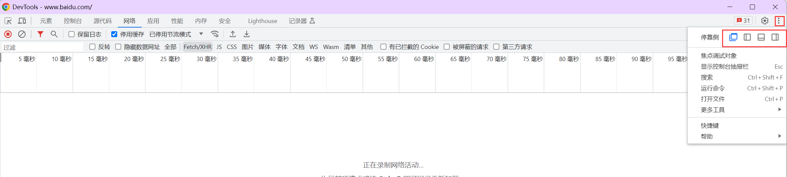

2）语言和颜色，重启后生效

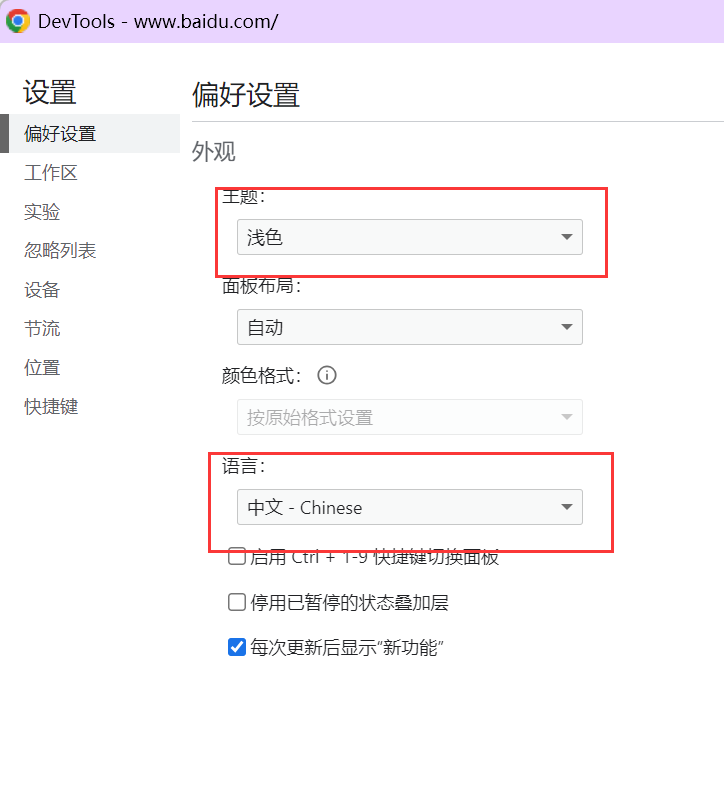

3）手机版本的切换，适合测试H5页面，小程序测试，可选不同尺寸的手机

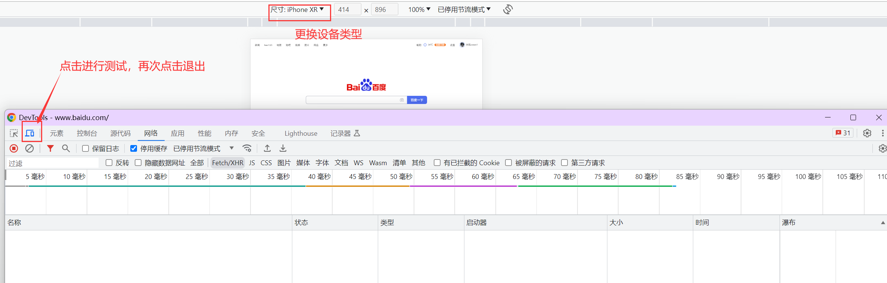

## **查看器/Elements** 

用途：可用于页面结构分析，页面元素分析（元素大小，页面布局），页面样式调整

点击左上角箭头选择相应元素进行源代码 定位和检查

定位到源代码之后，可以看到该元素的属性，如class等

修改元素的代码和属性

### 标签元素定位:star:

1）定位了页面元素的代码后，可直接双击想要修改的部分，然后就进行修改：修改后可以实时的在浏览器页面上观察到修改后的效果

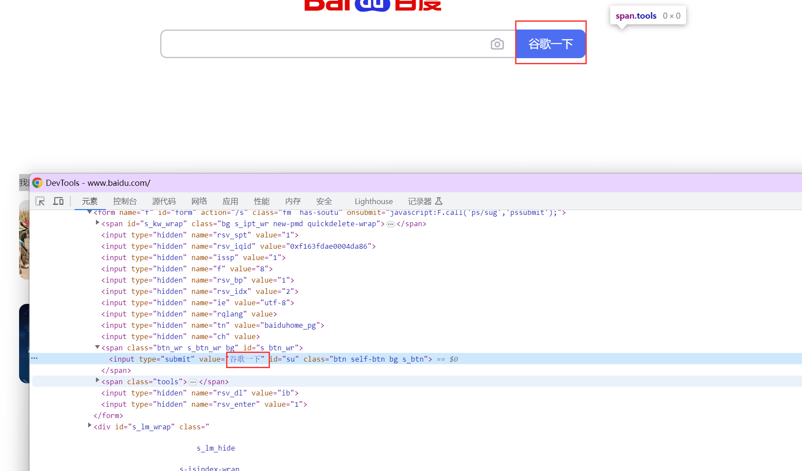

2）或者选中要修改部分后点击右键进行修改，如下图：

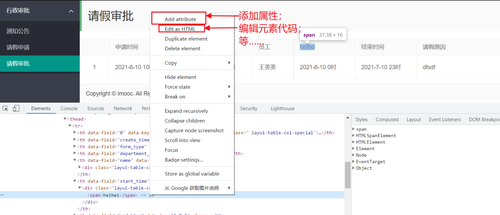

右侧工具栏，可以进行样式修改，时间监听等

> 注意：这个修改也仅对当前的页面渲染生效，不会修改服务器的源代码，故而这个功能也是作为调试页面效果而使用。

## **网络/Network**

网络面板，Network面板用于web抓包，记录了每条网络操作的相关信息。下面将重点介绍此面板。

这是使用最多的一个模块，主要用于测试问题的分析和定位，这个部分了记录了前后端的交互

前端和后端信息通过接口传输，Network记录了接口信息：(接口封装http协议)

http请求消息：请求行、请求头、请求体  --客户端发送

http响应消息：响应行、响应头、响应体  --服务器回应

抓到的报文分析：

状态：http的响应状态码

方法：http请求方法

域名：服务器的域名或者IP+端口

详细报文内容：消息头，cookies，请求，响应，耗时

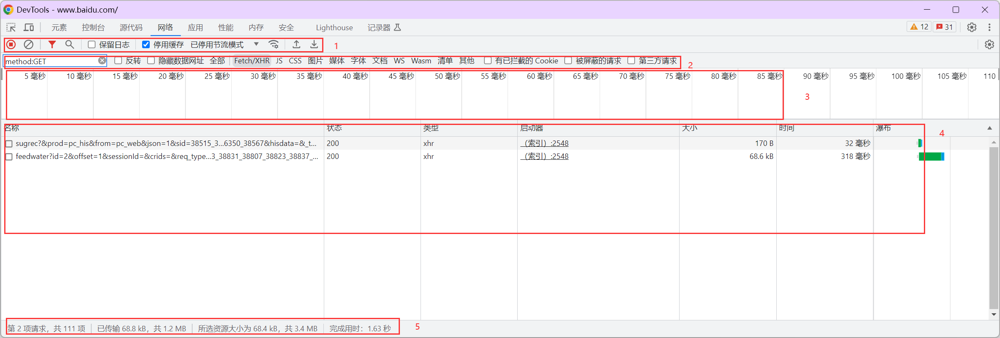

如上图所示，Network面板分为5个模块：

1. **Controls**：控制外观和功能

2. **Filters**：过滤器

3. **Overview**：资源检索时间的时间线

4. **Requests Table**：列出了检索的每个资源的详细信息

5. **Summary**：检索的概要

### **1.Controls**:star:

此模块为控制外观和功能，如停止抓包、清除记录、禁用缓存、离线、模拟网络环境等。

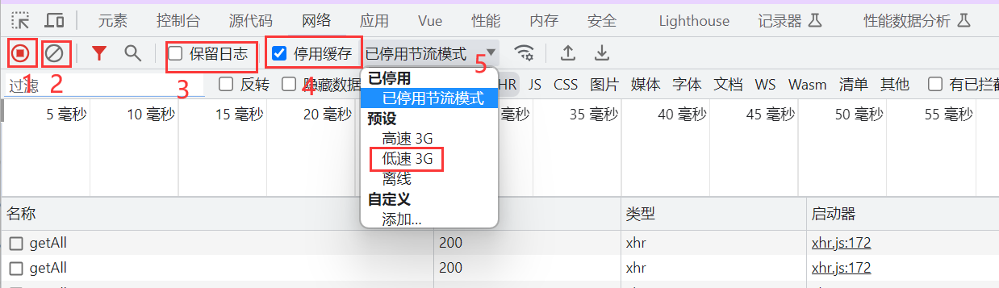

:star:停止抓包、清除记录、禁用缓存、离线、模拟网络环境

1. 停止抓包
2. 清楚记录
3. 保留日志：开启后，重新加载url，或者跳转页面之后，之前的请求信息依然会保留，不会清空
4. 停用缓存：开启后，页面资源不会存入缓存
5. 节流模式：

### **2.Filters**

可以从众多的请求中找出我们想要的请求，这时过滤器就很重要了。

默认是 All ，其右边还有很多，比如：XHR（ajax请求）、JS、CSS等，但是每次都只能选择一个，若想选择多个按住Ctrl不放，点击鼠标左键

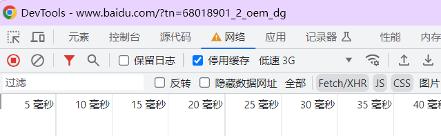

**Filter输入框**

在Filer输入框中输入字符串，会显示出给定字符串匹配的资源，同时也可以支持关键词，输入关键词后会自动显示，只会显示记录中已存在的类型

- **domain**

过滤指定域名

- **status-code**

显示指定状态码

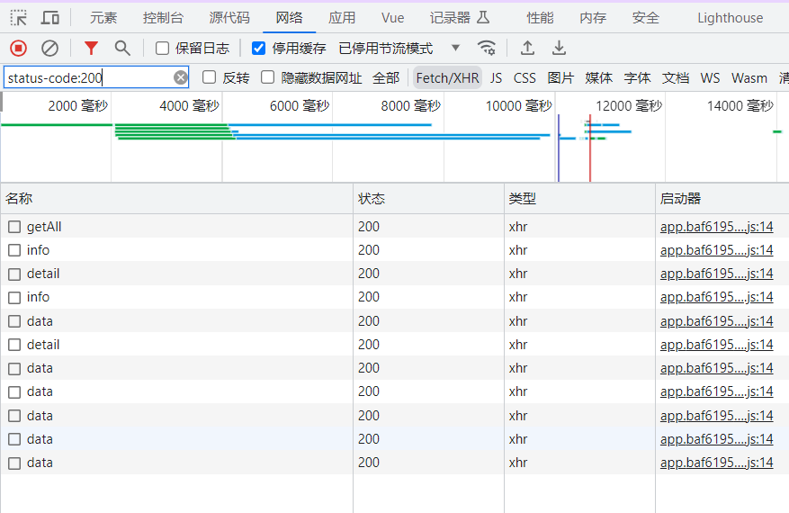

### **3.Overview**

查看资源检索的时间线，可调整起始和结束时间

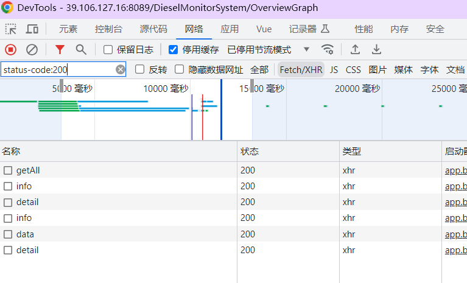

### 4 **Requests Table **:star:

具体的每条请求记录，可以在4中右键选择需要显示的字段，点击请求右键复制，可复制curl

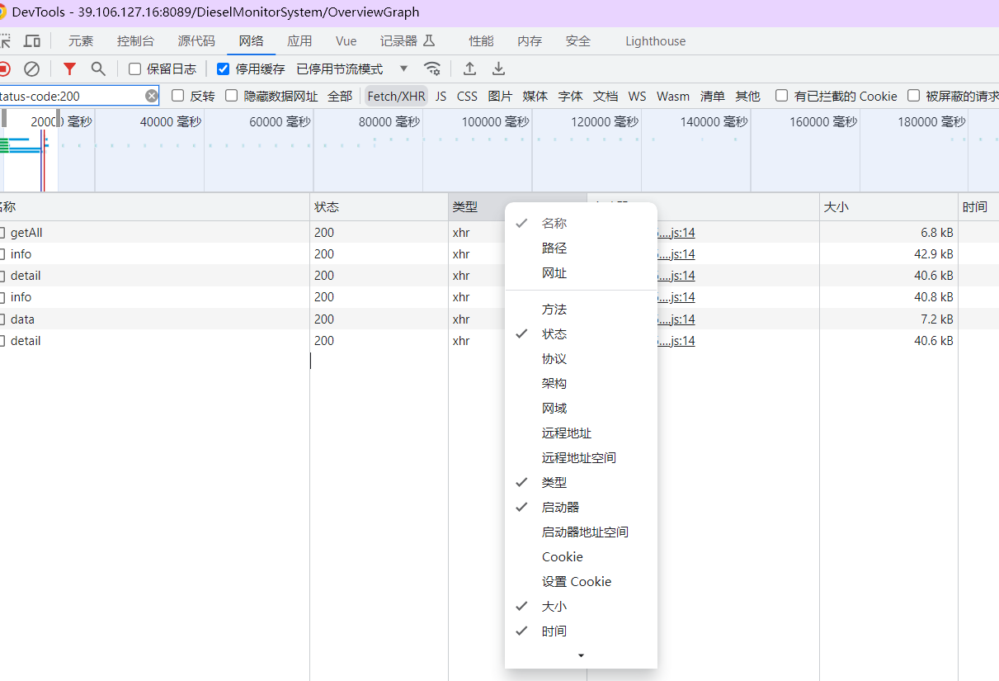

### **5.Summary**

在最下图可以看到：1.请求的总数 2.传输的数据量 3.加载的时间

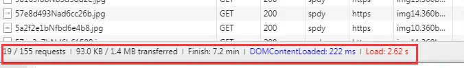

## 控制台/Console

控制台面板，可以作为shell在页面上与JaveScript交互

`console.log()`: 输出普通信息。

`console.error()`: 输出错误信息，并以红色字体显示。

`console.warn()`: 输出警告信息，并以黄色字体显示。

`console.table()`: 以表格形式输出数组或对象的内容。

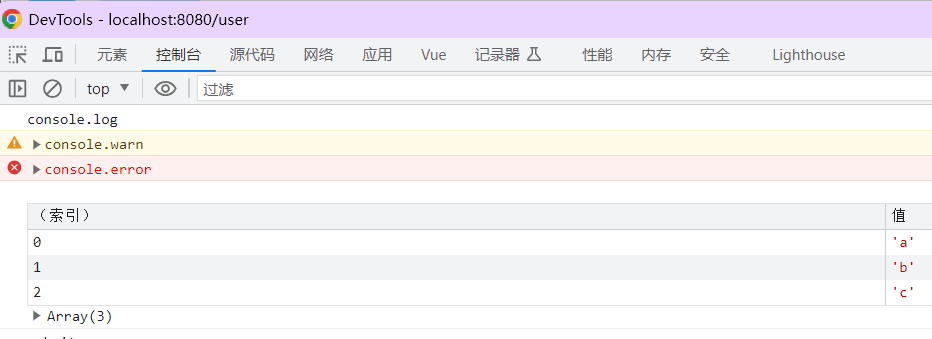

这些方法可以根据需要在开发过程中用于调试、错误处理和信息输出。

还有部分公司会把自己的招聘信息输出在控制台，例如百度

## 源代码、调试器/Source:star:

源代码面板，可以设置断点来调试JaveScript

我们可以使用console输出在控制台进行调试，但如果有多个变量就不方便，可以使用调试看到每一步之后的变量。

**debugger** 关键字用于停止执行 JavaScript，并调用调试函数。

这个关键字与在调试工具中设置断点的效果是一样的。

如果没有调试可用，debugger 语句将无法工作。

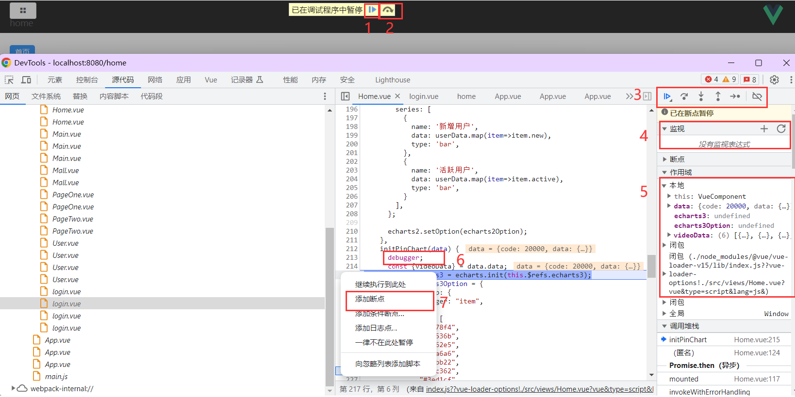

1. 点击1可直接跳到下一个执行路径上的断点
2. 点击单步执行
3. 更加细致的调试，可单步调试、跳出函数，停止调试
4. 监视某个变量的值，点击+添加
5. 查看走到每一步的变量
6. 在文本中添加debugger；就是添加一个断点
7. 也可以通过右键添加

## 应用/Application

应用面板，使用资源面板检查加载的所有资源，包括IndexedDB与Web SQL数据库，本地和会话存储，cookie，应用程序缓存，图像，字体和样式表。

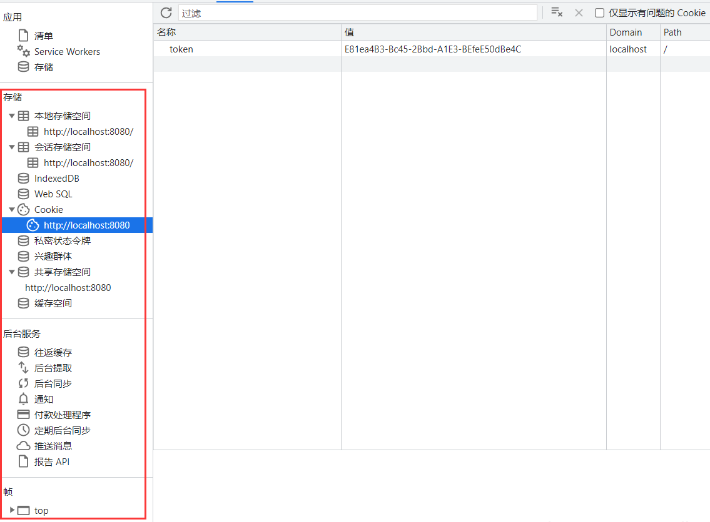

## 记录器脚本/Recorder:star:

它允许你录制 Web 页面的操作并支持**回放，编辑，测量性能** 等诸多功能。

通过它，你可以实现一些有趣的功能。

比如：

- 测试同学录制一段“脚本”， 然后发送给开发，开发根据这段脚本定位问题。
- 测试某一个业务流程在各种不同的网络和硬件环境下的表现，甚至你可以看其在不同平台的表现（比如 PC，手机，平板等）。

1. 点击+，创建新录制。
2. 点击开始录制
3. 对页面进行操作
4. 然后点击结束录制即可。
5. 建议选择慢速重放，否则会因为点击过快出一些问题
6. 可以导出json格式，然后发给其他人使用，方便进行联调

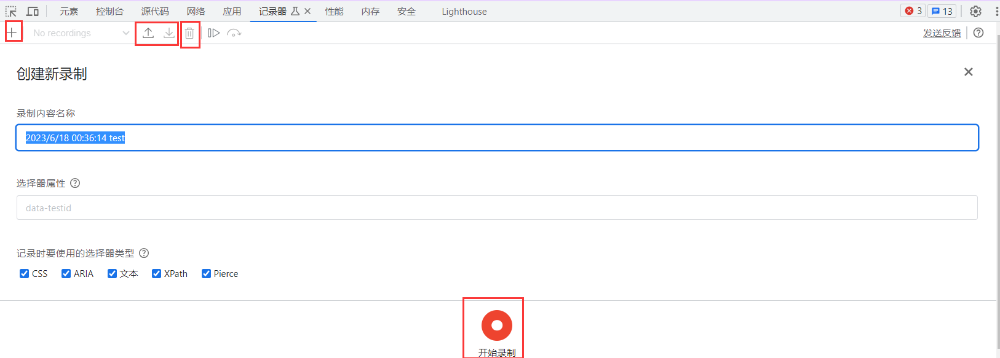

