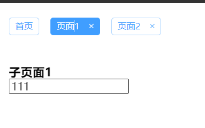
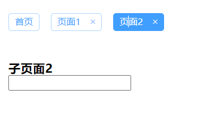
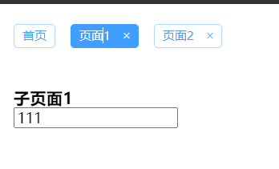
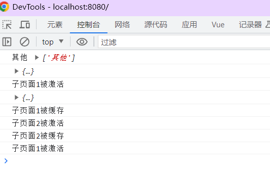

[官方文档](https://cn.vuejs.org/guide/built-ins/keep-alive.html#basic-usage)

在平常开发中，有部分组件没有必要多次初始化，这时，我们需要将组件进行持久化，**使组件的状态维持不变**，在下一次展示时，也不会进行重新初始化组件。

`keepalive` 是 `Vue` 内置的一个组件，可以**使被包含的组件保留状态，或避免重新渲染** 。也就是所谓的**组件缓存**

`<keep-alive>`是`vue`的内置组件，能在组件切换过程中将状态保留在内存中，防止重复渲染DOM。

具体来说，keep-alive 会缓存它包裹的组件的实例，在下一次渲染时直接使用缓存的实例，这样就避免了对应组件重新创建、挂载和销毁的过程，减少了不必要的性能开销。

下面通过样例进行演示。

### 1、配合组件使用

（1）效果

- 这是一个简单的 **Tab** 标签切换效果。当标签切换时，下方的两个自定义组件会随之切换显示。
- 由于两个子组件是包裹在 **<keep-alive>** 中，可以看到它们来回切换后，原来页面的内容和数据仍然保留，说明组件消失时并没有被销毁，而是缓存起来。







（2）代码

* 子页面1

```vue
<template>
  <div>
    <h3>子页面1</h3>
    <input type="text" name="" value="">
  </div>
</template>
<script>
export default {
  name: 'PageOne',
  data() {
    return {
    }
  },
  //keep-alive钩子函数：组件被激活时调用
  activated() {
    console.log('子页面1被激活');
  },
  //keep-alive钩子函数：组件消失，被缓存时调用
  deactivated() {
    console.log('子页面1被缓存');
  }
}
</script>
```

* 子页面2

```vue
<template>
  <div>
    <h3>子页面2</h3>
    <input type="text" name="" value="">
  </div>
</template>
<script>
export default {
  name: 'PageTwo',
  data() {
    return {
    }
  },
  //keep-alive钩子函数：组件被激活时调用
  activated() {
    console.log('子页面2被激活');
  },
  //keep-alive钩子函数：组件消失，被缓存时调用
  deactivated() {
    console.log('子页面2被缓存');
  }
}
</script>
```

那么在切换组件的时候，页面1不会被销毁，而是被缓存起来；页面2 也不是第一次创建，而是直接使用之前缓存的实例，实现了组件状态的保留和跨组件的复用。


如果在 `keep-alive` 包裹的 `<router-view>` 组件内部还存在一个嵌套的 `<router-view>` 组件，会导致一些潜在的问题。这是因为 `keep-alive` 组件是用于缓存当前激活的组件，以便在切换时保持其状态和数据。

当存在嵌套的 `<router-view>` 组件时，`keep-alive` 会将整个嵌套结构作为一个组件进行缓存，而不仅仅是其中的单个组件。这可能会导致以下问题：

1. 内部嵌套的组件可能无法正确地被缓存和恢复状态，因为 `keep-alive` 只会对最外层的组件进行缓存。
2. 在切换路由时，可能会导致内部嵌套的 `<router-view>` 组件的生命周期钩子不被调用，或者被调用的顺序不正确，从而影响组件的行为和状态。

为了避免这些问题，建议在使用 `keep-alive` 时，仅将最顶层的组件包裹在 `keep-alive` 内部，而不要包含嵌套的 `<router-view>`。如果需要在子组件内部也使用 `keep-alive`，可以将其分别放置在需要缓存的子组件上。

```vue
<template>
  <keep-alive>
    <router-view />
  </keep-alive>
</template>
```

如果确实需要在 `<router-view>` 内部嵌套一个 `<router-view>`，可以考虑使用其他方式来处理缓存和状态的保持，例如自定义的缓存机制或状态管理工具，以确保每个组件都能正确地被缓存和恢复状态。

### 2，钩子函数

（1）**<keep-alive>** 提供了如下两个生命周期钩子函数：

- **activated()**：组件被激活时调用。即组件第一次渲染时会被调用，之后每次 **keep-alive** 激活时也会被调用。通常我们可以在这个方法中实现：每次进入页面的时候获取最新的数据。
- **deactivated()**：组件被停用时调用。


（2）这两个钩子函数要注意的是：

- 只有组件被 **keep-alive** 包裹时，这两个生命周期函数才会被调用，如果作为正常组件使用，是不会被调用的。

- 即使组件被 **keep-alive** 包裹，如果使用 **exclude** 排除之后，，这两个钩子依然不会被调用。

- 加上keep-alive就不会执行destroy()

  不执行destroy()， 如果想在切换组件时实现相同效果，可以在deactivated中实现

（3）上面样例中我们在子组件内部的钩子函数中输出了一些信息，当我们打开页面，先切换到标签 **2** 再切回标签 **1**，控制台输出如下：



（4）在bs中，我们使用通过混入结合这两个函数实现离开页面清除当前页面定时器，返回页面时打开

```js
/**
 * keepAlive的公共生命周期函数
 * activated: 在打开页面且为实时状态下打开定时器
 * deactivated: 在离开页面时清除定时器
 */

const keepAliveMixin = {
  data() {
    return {
    }
  },

  activated() {
    // console.log('activated');
    if(this.nowstatus == 1) {
      if(typeof this.$options.methods['startall'] !== 'undefined') {
        this.startall();
      } else {
        this.startinterval();
      }
    }
  },
  deactivated() {
    // console.log('deactivated', this.myinterval);
    if(this.myinterval) {
      clearInterval(this.myinterval);
    }

    if (this.myinterval1) {
      clearInterval(this.myinterval1);
    }
    if (this.myinterval2) {
      clearInterval(this.myinterval2);
    }
  },

}
export default keepAliveMixin

```


### 3，选择性地缓存部分组件

**如果只想要`router-view`里面的某个组件被缓存，怎么办？**

1. 使用 `include` 和 `exclude`：

   ```vue
   <template>
     <keep-alive :include="['componentA', 'componentB']" :exclude="['componentC']">
       <router-view />
     </keep-alive>
   </template>
   ```

   通过设置 `include` 和 `exclude` 属性，可以控制只缓存特定的组件或排除某些组件。在上面的例子中，只有名为 `componentA` 和 `componentB` 的组件会被缓存，而 `componentC` 不会被缓存。

2. 动态缓存组件：

   ```vue
   <template>
     <keep-alive>
       <component :is="currentComponent" />
     </keep-alive>
   </template>
   ```

   这种用法允许根据条件动态切换需要缓存的组件。通过绑定 `currentComponent` 变量到不同的组件上，根据条件的变化，`<keep-alive>` 会自动缓存和切换不同的组件。

3. max属性

在 Vue 的 `keep-alive` 组件中，可以通过设置 `max` 属性来限制缓存的页面个数。`max` 属性指定了最大缓存的组件实例数量，当超过这个数量时，最早缓存的组件实例将会被销毁。

以下是一个示例代码，展示如何设置 `keep-alive` 缓存页面的个数：

```vue
<template>
  <keep-alive :max="3">
    <router-view></router-view>
  </keep-alive>
</template>
```

在上述示例中，我们将 `max` 属性设置为 `3`，表示最多缓存 3 个页面的组件实例。当超过 3 个页面时，最早缓存的组件实例将会被销毁，以释放资源。

通过设置 `max` 属性，你可以控制 `keep-alive` 缓存页面的个数，以适应你的应用需求。请根据实际情况选择合适的缓存页面个数，以平衡页面缓存和内存占用之间的关系。

4. 使用 meta 属性

> 优点：不需要例举出需要被缓存组件名称 使用$route.meta的keepAlive属性：，这也是我们在bs的用法

```html
<keep-alive>
    <router-view v-if="$route.meta.keepAlive"></router-view>
</keep-alive>
<router-view v-if="!$route.meta.keepAlive"></router-view>
```

需要在`router`中设置router的元信息meta：

```js
export default new Router({
  routes: [
    {
      path: '/',
      name: 'Hello',
      component: Hello,
      meta: {
        keepAlive: false // 不需要缓存
      }
    },
    {
      path: '/page1',
      name: 'Page1',
      component: Page1,
      meta: {
        keepAlive: true // 需要被缓存
      }
    }
  ]
})
```


### 4、页面动态决定是否需要缓存

 有时对于同一个页面组件，并不是一直都需要缓存，或者一直都不缓存。而是根据情况动态地改变。实现这种需求同样是通过配合 **router.meta** 属性来实现，我们根据情况动态地改变里面的 **keepAlive** 属性值即可。

（1）当我们从页面2跳转到页面1再跳回来，发现内容页面2数据仍然保留，说明页面2是缓存的。

（2）当我们从页面2跳转到页面1再跳回来，发现页面2数据已经清空，说明页面2这时又不缓存了。

在页面1组件添加以下代码：

```vue
beforeRouteLeave(to, from, next) {
//设置下一个路由的meta）
    to.meta.keepAlive = false;  //让下一个页面不缓存，即刷新
	 //to.meta.keepAlive = true;  //让首页缓存，即不刷新
    next();
}
```


# keep-alive缓存路由在动态路径参数中出现的问题

当使用 `keep-alive` 缓存相同路径但带有不同参数的组件时，`watch` 监听器会在组件从缓存中重新激活时同时触发。

### 修改watch方式

在bs中，我们是这样解决的，只有切换后的路由与之对应，才继续执行watch的内容

```vue
equid(val) {
    if(this.$route.path == '/RotatingMachineryGraph/RotatingHistoryTrendGraph')
    this.firstFlag = true;
},
```


### 设置key属性

在 Vue 中，使用 `<keep-alive>` 可以实现对组件的缓存，但有时候我们需要动态地创建或销毁缓存的组件，这时就需要使用 `key` 属性。

当我们为缓存的动态组件设置了 `key` 属性之后，在组件切换时，Vue 会根据 `key` 值来匹配缓存的组件：

- 如果当前组件和缓存的组件都有同样的 `key` 值，那么会直接使用缓存的组件。
- 如果当前组件没有 `key` 值，那么每次都会创建新的组件实例。
- 如果当前组件有 `key` 值，但是和缓存的组件的 `key` 值不一样，那么会销毁之前的缓存组件，并重新创建新的组件实例并缓存起来。

举一个简单的例子，在缓存两个不同的组件的情况下，可以使用 key 来区分它们：

```vue
<template>
  <div>
    <keep-alive>
      <component :is="myComponent" :key="myComponent"></component>
    </keep-alive>
    
    <button @click="changeComponent">Change Component</button>
  </div>
</template>

<script>
export default {
  data() {
    return {
      myComponent: 'A'
    }
  },
  methods: {
    changeComponent() {
      this.myComponent = this.myComponent === 'A' ? 'B' : 'A'
    }
  }
}
</script>
```

在这个例子中，我们用一个简单的按钮来切换两个不同的动态组件。`<keep-alive>` 中的 `<component>` 标签会根据 `myComponent` 的不同值来渲染不同的组件。同时，它们都带有相同的 `key` 值，在组件切换时可以直接从缓存中读取、恢复状态。

通过为每个缓存的组件设置唯一的 `key`，可以确保即使组件的路径和参数相同，它们仍然是独立的实例，不会相互影响或触发多次事件。

```vue
:key = "$route.fullpath"
```

当然，如果我们更改了组件的 `key` 值，那么对应的缓存也会失效，需要重新创建和挂载组件。所以在使用 `key` 属性时，需要谨慎处理，避免出现其他问题。


ocalhost:8081/RotatingMachineryGraph/OrbitOfShaftCenter1?equipmentUuid=1

ocalhost:8081/RotatingMachineryGraph/OrbitOfShaftCenter1?equipmentUuid=2

